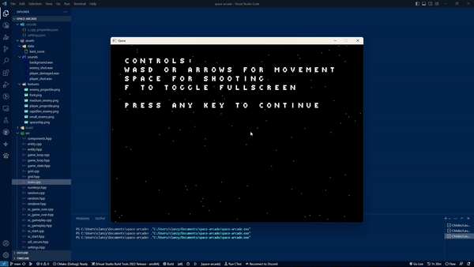

# Space arcade

## About this project

This pet project is a retro style arcade game made with SDL library.



## Building

### Linux

First you need to install SDL2, SDL2_image, SDL2_mixer libraries. You can find detailed guide for SDL2 on [this page](https://wiki.libsdl.org/SDL2/Installation). **Note**: you should build it from source, because some distributions' package managers have outdated version of SDL library that doesn't have CMake support. For SDL2_image and SDL2_mixer you can execute the same commands but add `_image` and `_mixer` endings.

```text
cmake -S . -B "build"
cmake --build build --config Release
./build/space-arcade
```
